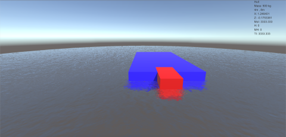
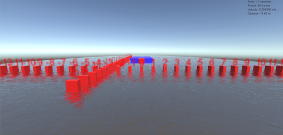
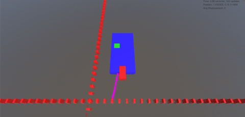
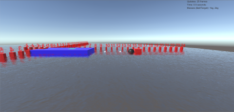

#### COMP 8903 Boat Physics

*By Michael Goll*

######Technology Used:
  - Language: **C#**
  - Engine: **Unity 2017**

The purpose of the following project is to use physics calculations to accurately simulate the real-world environment. The following uses an example of a boat with 3 major components:
  - Hull
  - Pilot
  - Cannon

Each component has its own unique characteristics such as weight, dimensions, and position within the world space.

The project is broken up into 12 pieces--each presenting a different scenario.

######Usage of Unity 2017
Unity 2017 was used in order to render the simulation. It is also used to keep consistent time steps throughout all simulations and keep track of the world coordinates for objects. **All physics calculations are done manually and the results are applied to the world.**

#####Labs
  - [Lab 1: Composite Object Calculations](#lab-1)
  - [Lab 2: Linear Motion](#lab-2)
  - [Lab 3: Basic Projectile Motion](#lab-3)
  - [Lab 4: Regular Projectile Motion](#lab-4)
  - [Lab 5: Advanced Projectile Motion](#lab-5)
  - [Lab 6: Basic Forces](#lab-6)
  - [Lab 7: Dynamic Drag](#lab-7)
  - [Lab 8: 3-D Projectile Drag](#lab-8)
  - [Lab 9: Linear Projectile Collision](#lab-9)
  - [Lab 10: Angular Projectile Collision](#lab-10)
  - [Lab 11: Projectile Collision with Rotations](#lab-11)
  - [Final Lab: Open World Physics](#final-lab)

---

###Lab 1: Composite Object Calculations
_Lab 1_ consists of very basic physics calculations of a composite object. The total boat consists of the hull, the pilot and the cannon.

The lab calculates the following:
  - Mass
  - Dimensions
  - X and Y position
  - Moment of inertia
  - Total inertia

The boat can be moved around the world using the **W, A, S, and D** keys. The values are calculated real-time and recalculate accordingly.

######User Input
| Key | Function |
| :------------- | :------------- |
| W | Move Forwards |
| A | Move Backwards |
| S | Move Left |
| D | Move Right |
| 1 | Show Hull Stats |
| 2 | Show Pilot Stats |
| 3 | Show Cannon Stats |
| 4 | Show Combined Stats |

---

###Lab 2: Linear Motion

_Lab 2_ simulates the boat under either a constant acceleration or a constant drag.

It calculates:
  - Final position of the boat/object after a given time interval.

######User Input
| Key | Function |
| :------------- | :------------- |
| Use Drag (toggle) | Whether or not the simulation uses the **drag constant** to slow the boat/object down. |
| Velocity | The initial velocity of the boat/object. |
| Acceleration | The acceleration of the boat/object. |
| Time | The time interval (in seconds) in which the boat/object moves. For example, a value of _2_ means the boat will move for 2 seconds. |

---

###Lab 3: Basic Projectile Motion

_Lab 3_ simulates a projectile fired from the rear-mounted cannon on the boat as it hits a target.

Given an initial velocity of the cannon ball from the user, the lab calculates the following:
  - Distance the target is from the boat
  - Angle at which the cannonball/projectile needs to be launched at in order to hit the target
  - Time it takes for the ball to travel to its target in both number of frames and seconds.

The cannonball/projectile will stop when the Y position is less that 0.05 units from the water.

The simulation is basic here as the **target always remains in a linear path from the boat** (ie. the target is always directly in-front or directly behind the boat).

######Data Input
| Inspector Name | Description |
| :------------- | :------------- |
| Gun Ball Velocity | Velocity of the cannonball/projectile as it leaves the cannon. |

---

###Lab 4: Regular Projectile Motion

_Lab 4_ builds onto Lab 3 so that the target can now be to either side of the boat, as well as in front or behind.

The lab calculates the following:
  - Gamma and Alpha rotation values of the cannon.
  - Time it takes for the ball to travel to its target in both number of frames/updates and seconds.

The cannonball/projectile will stop when the Y position is less that 0.05 units from the water.

######Data Input
| Inspector Name | Description |
| :------------- | :------------- |
| Gun Ball Velocity | Velocity of the cannonball/projectile as it leaves the cannon. |

---

###Lab 5: Advanced Projectile Motion
_Lab 5_ fires a projectile from the rear-mounted cannon towards a target as well as tracks the rotation of the projectile when backspin is applied to it. It draws the path of the small sphere on the projectile which tracks the spin.

The lab calculates the following:
  - Angular velocity of the projectile
  - Angular acceleration of the projectile
  - Time it takes for the projectile to arrive at its target.

The cannonball/projectile will stop when the Y position is less that 0.05 units from the water.

######Data Input
| Inspector Name | Description |
| :------------- | :------------- |
| Gun Ball Velocity | Velocity of the cannonball/projectile as it leaves the cannon. |
| Omega I | Initial omega angle of the cannonball/projectile. |
| Alpha I | Initial alpha angle of the  |

  - Both Alpha I and Omega I combined determine how many times the cannonball/projectile spins as it travels

---

###Lab 6: Basic Forces
_Lab 6_ simulates what happens when a constant force is applied through the direct center of mass of the composite object.

The lab does two scenarios--one linear and one angular. The linear scenario applies the force in a linear line whereas the angular scenario creates an angular acceleration using the user-given force.

The lab calculates:
  - Time it takes for the object to reach within 0.05 units of its final position.
  - Position in world-space the object is.
  - Angular displacement of the object.

######Data Input
| Inspector Name | Description |
| :------------- | :------------- |
| Force | Strength of the force applied to the boat/object. The higher the number, the stronger the force. |
| Angular Force | How strong the force acting on the boat/object from an angle is. |
| Angle | The angle in which the force is applied (in degrees). |
| Din Z | Final displacement the boat/object should travel towards in the Z-axis. |
| LD | The final angular displacement towards the left (counter-clockwise) of the boat/object. |
| RD | The final angular displacement towards the right (clockwise) of the boat/object. |

---
(#lab-7)
###Lab 7: Dynamic Drag
_Lab 7_ simulates a dynamic drag coefficient which causes the boat to slow down from an initial velocity.

It also has a toggle for _dynamic controls_ which allows the user to apply a force until the boat reaches its maximum velocity. Releasing the key stops applying the force and the boat decelerates until it stops. Otherwise, the force is applied initially and the boat/object decelerates until it stops.

The lab calculates:
  - Elapsed time in seconds and number of updates/frames.
  - Acceleration of the boat/object.
  - Distance travelled by the boat/object.
  - Thrust and Torque.
  - Distance and Velocity.

######Data Input
| Inspector Name | Description |
| :------------- | :------------- |
| Dynamic Controls (toggle)| Whether or not the program will use user input for applying the force. |
| Drag Coefficient | How strong the drag force acting upon the boat/object is. Higher number is stronger. |
| Angular Force | How strong the force acting on the boat/object from an angle is. |
| Angle | The angle in which the force is applied (in degrees). |

######User Input
| Key | Function |
| :------------- | :------------- |
| Space | Start/Stop Simulation |
| Press/Hold W | Apply Force |
| Release W | Stop Applying Force|

---

###Lab 8: 3-D Projectile Drag
_Lab 8_ simulates the 3-D projectile launch with the two forces, _wind_ and _drag_, acting upon it.

The cannonball/projectile will stop 0.05 units above the water.

The lab calculates:
  - Elapsed time in seconds and number of updates/frames.
  - Position of the cannonball/projectile in world-space.
  - Tau
  - Wind velocity and coefficient.
  - Alpha and Gamma angles (in both degrees and radians).
  - Distance and velocity of the projectile.

######Data Input
| Inspector Name | Description |
| :------------- | :------------- |
| Drag Coefficient | How strong the drag force acting upon the cannonball/projectile is. Higher number is stronger. |
| Proj Mass | Mass of the projectile. |
| Gun Ball Velocity | Velocity of the cannonball/projectile as it leaves the cannon. |

######User Input
| Key | Function |
| :------------- | :------------- |
| Space | Start Simulation |

---

###Lab 9: Linear Projectile Collision
_Lab 9_ simulates the projectile being launched linearly into a moving target. The target is always in-front of the boat and either moves towards the boat or away from the boat.

Detects moment of impact and calculates the velocity of both the projectile and the target, preserving momentum.

The lab calculates:
  - Elapsed time in seconds and number of updates/frames.
  - Position of the cannonball/projectile in world-space.
  - Distance and velocity of the projectile.
  - Restitution coefficient.
  - Momentum
  - Drag on the projectile.

######Data Input
| Inspector Name | Description |
| :------------- | :------------- |
| Target Mass | Mass of the target. |
| Proj Mass | Mass of the projectile. |
| Gun Ball Velocity | Velocity of the cannonball/projectile as it leaves the cannon. |
| E | Restitution Coefficient; Determines whether or not the objects stick together or bounce off after impact. Value between 0 and 1. |

######User Input
| Key | Function |
| :------------- | :------------- |
| Space | Start/Stop/Resume Simulation |

**At Collision:**

**After Collision:**

---

###Lab 10: Angular Projectile Collision
_Lab 10_ simulates the projectile being launched  into a moving target, reacting at an angle.

Detects moment of impact and calculates the velocity of both the projectile and the target, as well as the angle in which it will travel all while preserving momentum.

The lab calculates:
  - Elapsed time in seconds and number of updates/frames.
  - Position of the cannonball/projectile in world-space.
  - Distance and velocity of the projectile.
  - Restitution coefficient.
  - Momentum.
  - Drag on the projectile.
  - Reaction angle of both objects.

######Data Input
| Inspector Name | Description |
| :------------- | :------------- |
| Target Mass | Mass of the target. |
| Target Velocity | Initial velocity of the target. |
| Proj Mass | Mass of the projectile. |
| Gun Ball Velocity | Velocity of the cannonball/projectile as it leaves the cannon. |
| E | Restitution Coefficient; Determines whether or not the objects stick together or bounce off after impact. Value between 0 and 1. |

######User Input
| Key | Function |
| :------------- | :------------- |
| Space | Start/Stop/Resume Simulation |

**At Collision:**

**After Collision:**

###Lab 11: Projectile Collision with Rotations
_Lab 11_ simulates two cube-shaped projectiles being fired into one another. Both objects collide with a flat side, causing them to spin.

Detects moment of impact and calculates the velocity of both the projectile and the target, the angle in which it will travel, speed of the spin after colliding and momentum preservation.

The lab calculates:
  - Elapsed time in seconds and number of updates/frames.
  - Position of the cannonball/projectile in world-space.
  - Distance and velocity of the projectile.
  - Restitution coefficient.
  - Momentum
  - Drag on the projectile.
  - Reaction angle of both objects.
  - Spin of both objects.

######Data Input
| Inspector Name | Description |
| :------------- | :------------- |
| Target Mass | Mass of the target. |
| Target Velocity | Initial velocity of the target. |
| Proj Mass | Mass of the projectile. |
| Gun Ball Velocity | Velocity of the cannonball/projectile as it leaves the cannon. |
| E | Restitution Coefficient; Determines whether or not the objects stick together or bounce off after impact. Value between 0 and 1. |

######User Input
| Key | Function |
| :------------- | :------------- |
| Space | Start/Stop/Resume Simulation |

**At Collision:**

**After Collision:**

---

###Final Lab: Open World Physics
The _Final Lab_ gives the user complete control of the boat, allowing the user to pilot the boat around the game world.

The boat will accelerate until it reaches its terminal velocity and decelerate using drag forces as well as steer using a rudder-style control scheme. There are no objects to collide with.

The lab calculates:
  - Elapsed time in seconds.
  - Real-time velocity of the boat.
  - Real-time acceleration of the boat.
  - Real-time distance travelled.

######Data Input
| Inspector Name | Description |
| :------------- | :------------- |
| Drag Coefficient | How strong the drag force acting upon the boat/object is. Higher number is stronger. |

######User Input
| Key | Function |
| :------------- | :------------- |
| Space | Start/Stop/Resume Simulation |
| W | Apply forward force |
| Q | Apply left force/rudder left |
| E | Apply right force/rudder right |

